# Lektion 1: Ändringsförfrågan

I kursens första lektion lär vi oss att skapa en ändringsförfrågan *pull request* för ett befintligt projekt på GitHub. Lektionen utgår ifrån att du redan har en lokal kopia av projektet och att denna kopia är öppnad i Visual Studio Code. Starta i filhanteringsfliken.

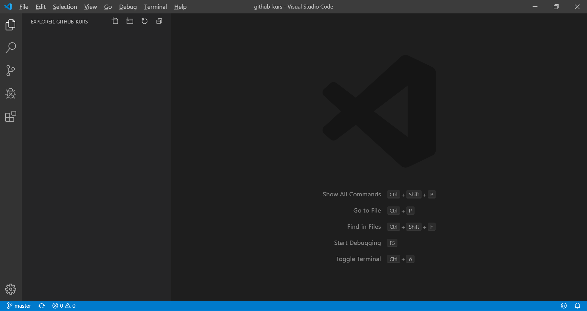

Skapa en ny fil och fyll den med något kul meddelande.

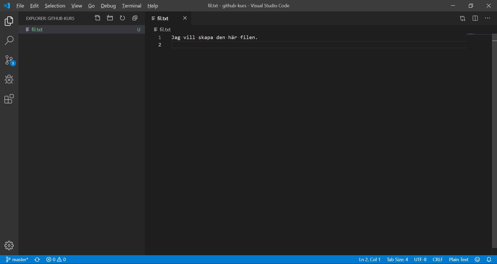

Växla till versionshanteringsfliken och notera att din nya fil har markerats som ej versionshanterad.

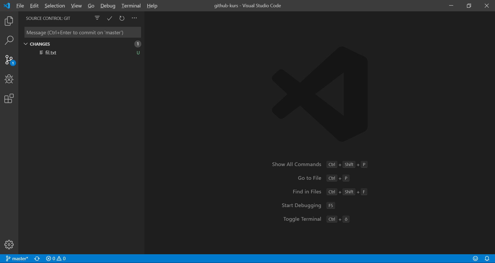

Klicka på •••-ikonen i det övre högra hörnet för att öppna en meny med versionshanteringskommandon.

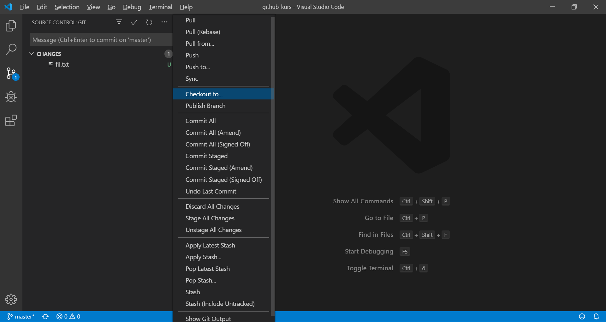

Välj alternativet "Checkout to...".

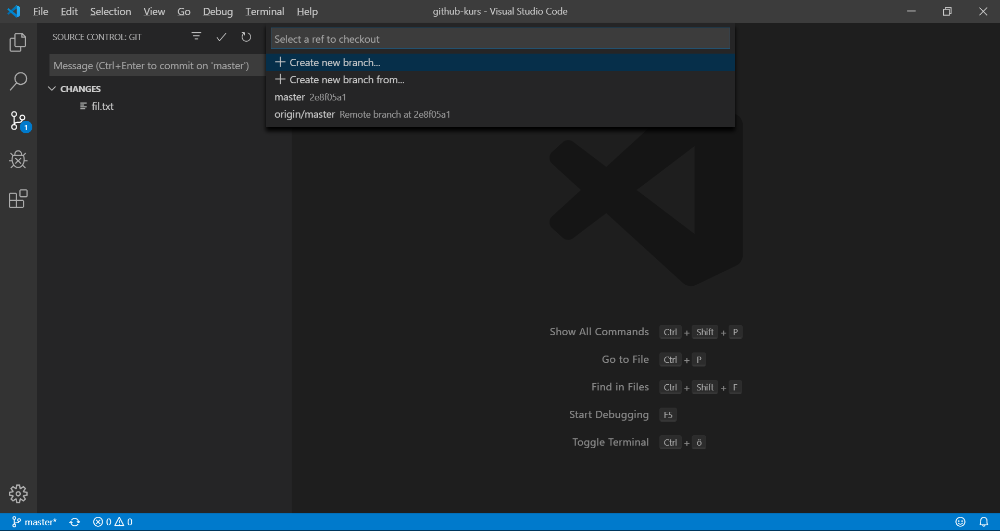

Välj alternativet "Create new branch..." för att skapa en arbetsgren med ursprung i den aktiva versionen. Den aktiva versionen är här den senaste sparade ändringen på grenen "master".

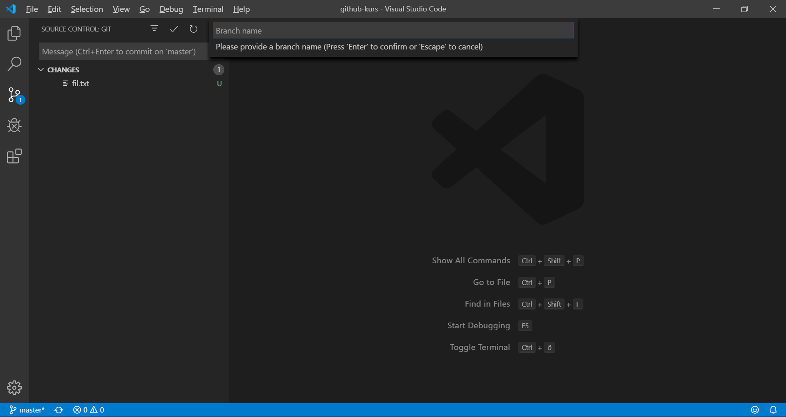

Skriv in ett kul namn för din nya arbetsgren. Formatet "wip-*" rekommenderas för grenar som så småningom ska bli ändringsförfrågningar. 

Alla ändringar som sparas kommer nu att hamna på din arbetsgren. Notera att din nyligen skapade fil fortfarande inte är versionshanterad.

Klicka på filen i versionshanteringsfliken för att se ändringar som gjorts men ännu inte valts. Tryck på +-symbolen bredvid filen för att välja samtliga ändringar i filen.

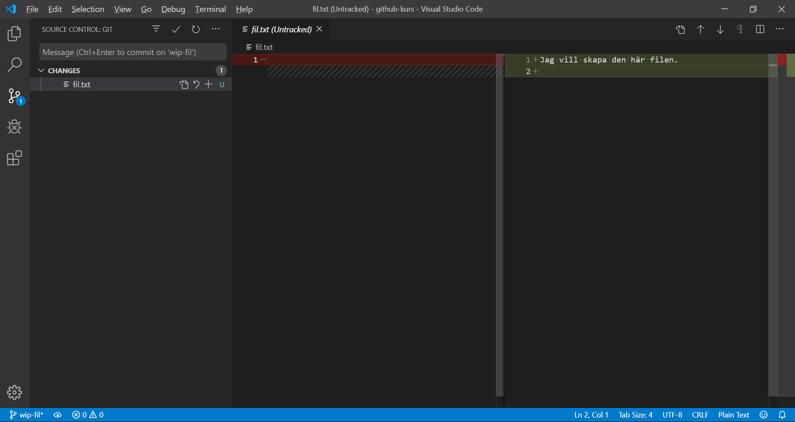

Notera att dina ändringar nu har valts men ännu inte sparats.

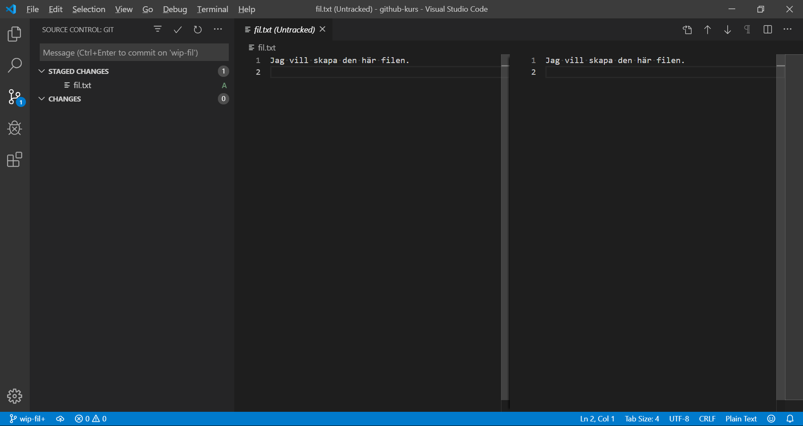

Mata in en kul beskrivning för dina ändringar i inmatningsfältet till vänster.

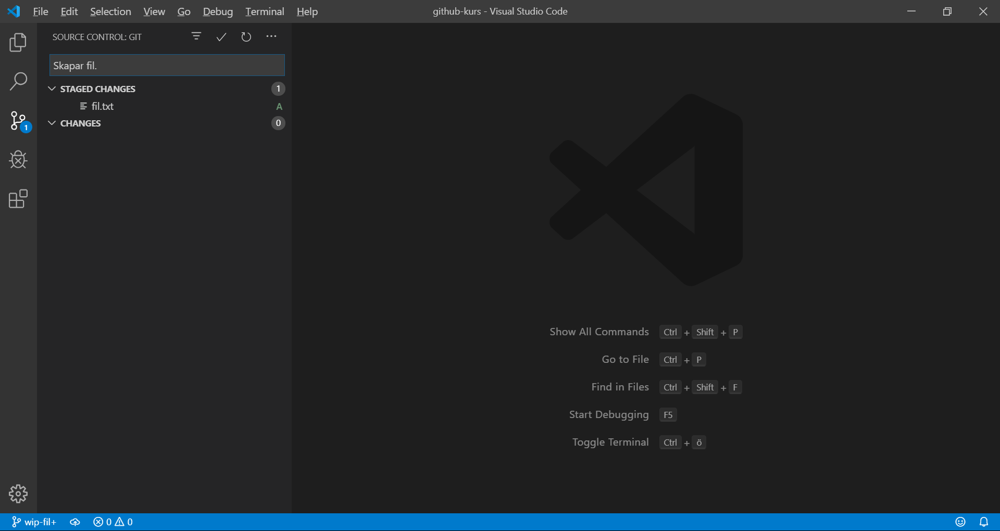

Tryck på ✓-ikonen för att spara dina ändringar med den inmatade beskrivningen. Notera att dina ändringar inte längre syns i versionshanteringfliken.

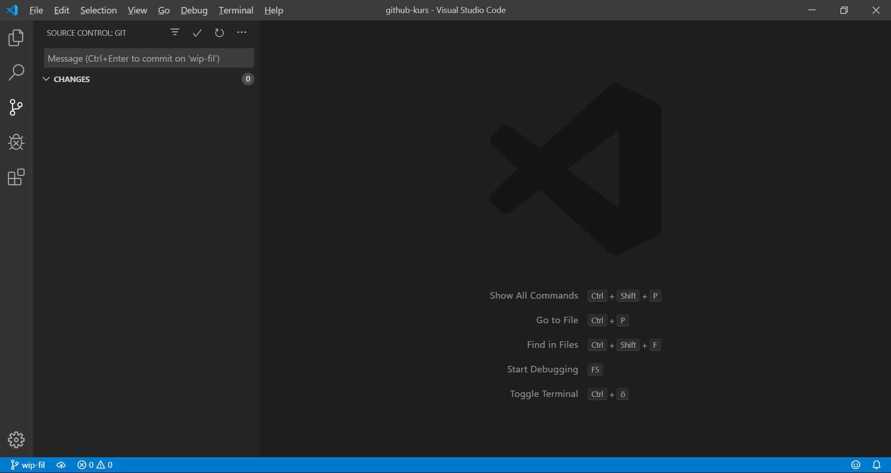

Tryck på •••-ikonen i det övre högra hörnet igen.

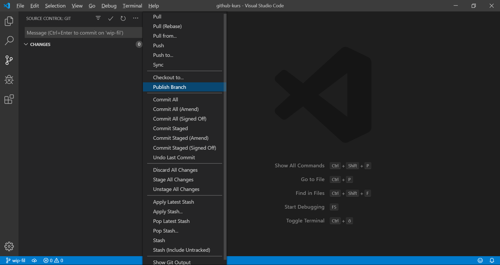

Välj alternativet "Publish Branch" för att publicera din arbetsgren och dess sparade ändringar till fjärrprojektet på GitHub. Du kan fortsätta att spara ändringar efter det att grenen har publicerats men ändringarna kommer inte automatiskt att skickas till fjärrprojektet.

Växla till filhanteringsfliken och notera att filen du skapade finns kvar.

Växla tillbaka till versionshanteringsfliken och klicka ännu en gång på •••-ikonen i det övre högra hörnet.

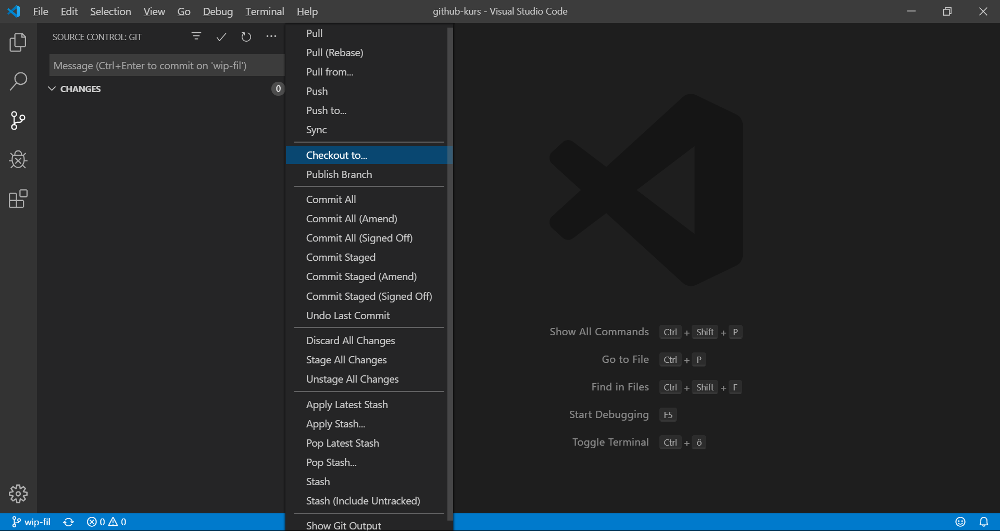

Välj alternativet "Checkout to..." för att växla arbetsgren.

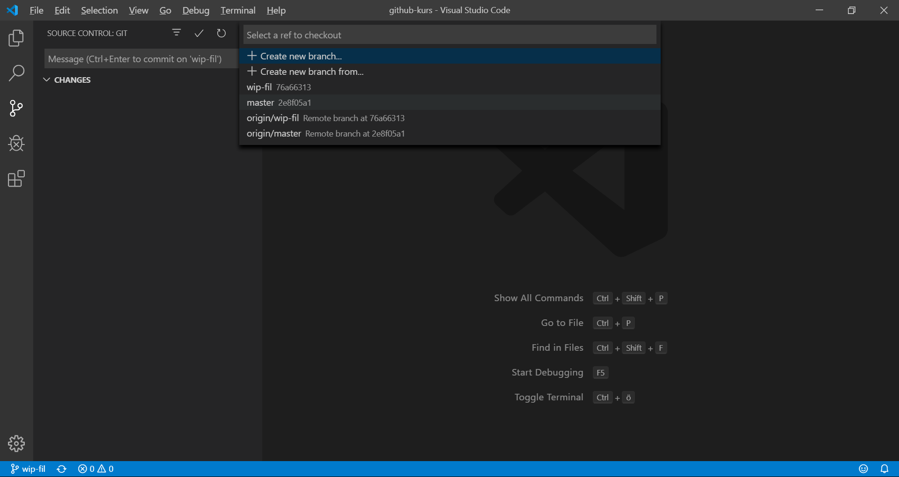

Klicka på grenen master.

Notera att det inte finns några ändringar i versionshanteringsfliken och växla sedan till filhanteringsfliken.

Notera att dina sparade ändringar inte längre syns då dessa sparades på din arbetsgren och att du nu arbetar på grenen "master".

Öppna en kul webbläsare och navigera till projektet på GitHub och notera att din arbetsgren dyker upp.

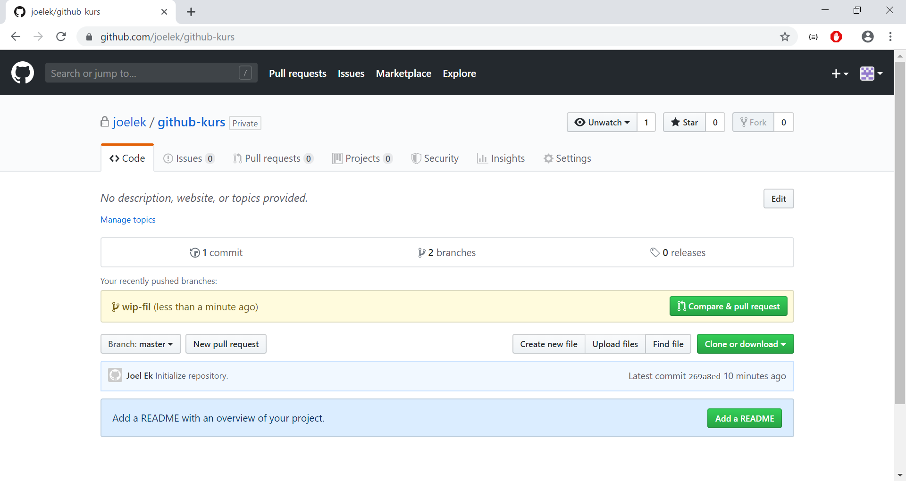

Klicka på knappen "Compare & pull request" för att jämföra skillnaderna mellan din arbetsgren och grenen "master".

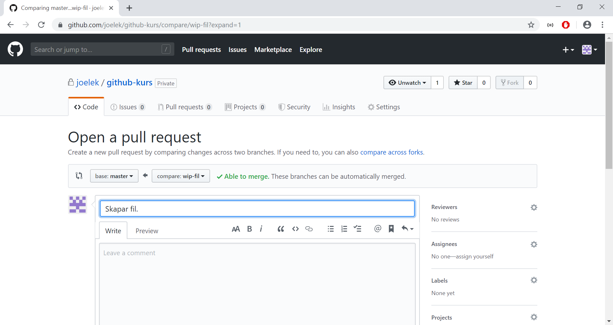

Du kan ge din ändringsförfrågan en bra titel och en koncis beskrivning och kan till och med lägga till en kollega som granskare *reviewer*. Klicka på knappen "Create pull request" för att skapa en ändringsförfrågan *pull request*.

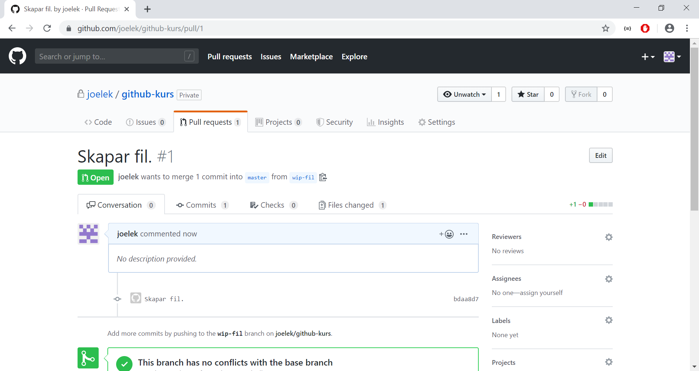

När dina ändringar är granskade och godkända av din kollega klickar du på knappen "Merge pull request" för att infoga din arbetsgren i grenen "master".

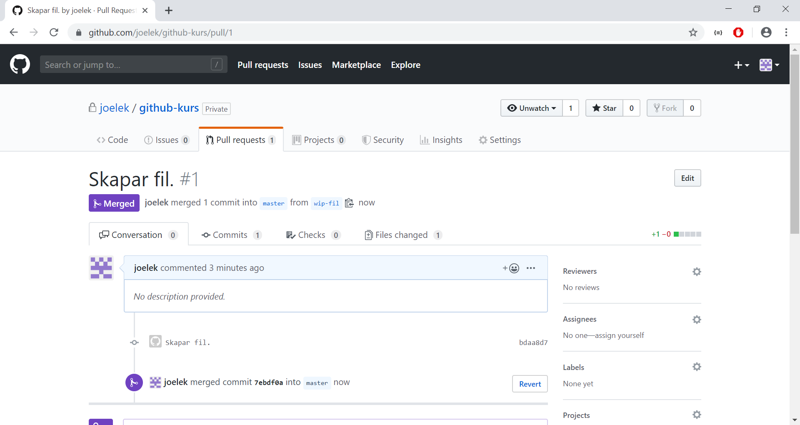

Växla tillbaka till Visual Studio Code och tryck på synkroniseringsknappen i det nedre vänstra hörnet. Dina ändringar syns nu i filhanteringsfliken!

Hemläxa: Gör en ändring i Linuxkärnan, öppna en ändringsförfrågan och få den godkänd och infogad.
